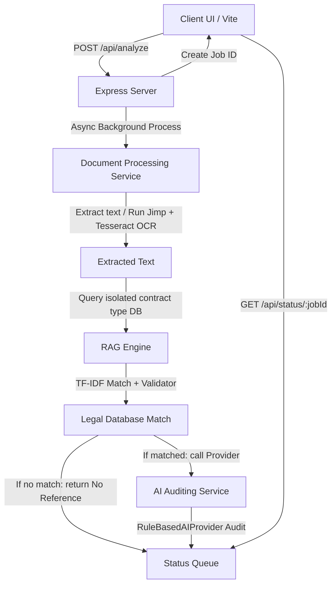

# Bayyin | بيّن — Explainable Legal Contract Analyzer

Bayyin (بيّن) is a backend-decoupled, RAG-gated compliance auditing and explainable legal contract analysis platform. It analyzes uploaded contracts against official Saudi government regulations, isolates risks, maps terms directly to verified statutory articles, and details the AI reasoning timeline in bilingual (Arabic/English) formats.

---

## 🏗️ System Architecture

Bayyin is built on a backend-ready, decoupled client-server architecture:



- **Frontend (Vite Single Page App)**: Contains all UI pages, localization switches, responsive CSS layouts, and polling coordinates. It communicates via relative paths, proxying API requests internally to port 5000.
- **Backend (Express Node Server)**: Handles multipart file uploads, queues jobs asynchronously in memory, processes documents through text extractors, runs TF-IDF RAG queries, and audits clauses under isolated rules.
- **Audit Logging**: Logs every RAG query, matched reference, AI prompt payload, and response to [server/logs/audit.log](file:///C:/Users/User/.gemini/antigravity/scratch/bayyin/server/logs/audit.log).

---

## 📂 Folder Structure

```text
bayyin/
├── public/                      # Static client assets
│   ├── favicon.svg
│   └── icons.svg
├── server/                      # Express backend service directory
│   ├── data/                    # JSON Legal Reference Knowledge Base
│   │   ├── banking.json
│   │   ├── employment.json
│   │   ├── rental.json
│   │   ├── subscriptions.json
│   │   ├── telecom.json
│   │   └── usedCars.json
│   ├── logs/                    # Transparency Audit Logs
│   │   └── audit.log
│   ├── services/                # Business logic engines
│   │   ├── aiService.js         # Gated compliance auditor (AIProvider interface)
│   │   ├── classifierService.js  # Language and category classifier
│   │   ├── documentService.js   # PDF stream readers & Jimp/Tesseract OCR
│   │   └── ragService.js        # TF-IDF query matcher (KnowledgeBaseAdapter)
│   ├── ara.traineddata          # Arabic OCR dictionary files
│   ├── eng.traineddata          # English OCR dictionary files
│   ├── index.js                 # API server router
│   ├── package-lock.json
│   └── package.json             # Backend dependencies
├── src/                         # Frontend client directory
│   ├── assets/                  # Images and illustrations
│   ├── contractsData.js         # Static titles & localized labels
│   ├── main.js                  # Frontend coordinator (polling/DOM controller)
│   ├── ocrSimulator.js          # Browser file type validator
│   └── style.css                # CSS styling rules
├── index.html                   # HTML entry point (CDNs cleaned)
├── package-lock.json
├── package.json                 # Frontend dependencies (Vite environment)
└── vite.config.js               # Vite configurations with proxy mapping
```

---

## ⚙️ Backend REST APIs

### 1. Upload Analysis Job
- **Route**: `POST /api/analyze`
- **Headers**: `Content-Type: multipart/form-data`
- **Body Params**:
  - `contractFile` (File binary: PDF, DOCX, JPG, PNG, HEIC)
  - `contractType` (String: `employment`, `rental`, `banking`, `telecom`, `subscription`, `car`)
- **Success Response** (`200 OK`):
  ```json
  { "jobId": "job_1721474251000_3x8b9" }
  ```

### 2. Poll Job Status
- **Route**: `GET /api/status/:jobId`
- **Success Response (Processing)** (`200 OK`):
  ```json
  {
    "status": "processing",
    "progress": 35,
    "statusAr": "جاري استخراج النصوص...",
    "statusEn": "Extracting text...",
    "stage": 2
  }
  ```
- **Success Response (Completed)** (`200 OK`):
  ```json
  {
    "status": "completed",
    "extractedText": "...",
    "report": {
      "overallStatus": "attention",
      "finalReport": {
        "stats": { "total": 2, "safe": 0, "attention": 2, "risk": 0, "undocumented": 0 }
      },
      "clauses": [
        {
          "id": "emp_ref2",
          "title": { "en": "Probationary Period", "ar": "فترة التجربة" },
          "originalText": { "en": "The trial period is 180 days.", "ar": "فترة التجربة 180 يوم." },
          "riskLevel": "attention",
          "explanation": { "en": "...", "ar": "..." },
          "why": { "en": "...", "ar": "..." },
          "reasoning": { "en": "...", "ar": "..." },
          "recommendation": { "en": "...", "ar": "..." },
          "reference": {
            "authority": { "en": "...", "ar": "..." },
            "lawName": { "en": "Saudi Labor Law", "ar": "نظام العمل السعودي" },
            "articleNumber": "Article 53",
            "articleText": { "en": "...", "ar": "..." },
            "url": "https://www.qiwa.sa/ar/labor-law"
          },
          "confidence": { "level": "high", "reason": { "en": "...", "ar": "..." } }
        }
      ]
    },
    "telemetry": {
      "method": "Direct PDF Text",
      "confidence": 100,
      "pages": 1,
      "language": "Arabic",
      "charCount": 1024,
      "detectedType": "employment"
    }
  }
  ```
- **Failure Response (Failed)** (`200 OK` or `500`):
  ```json
  {
    "status": "failed",
    "error": "This document could not be read accurately.",
    "diagnostics": {
      "fileReceived": true,
      "fileName": "contract.pdf",
      "fileSize": 12504,
      "fileExtension": "pdf",
      "mimeType": "application/pdf",
      "methodSelected": "OCR",
      "serviceExecuted": true,
      "ocrExecuted": true,
      "charCount": 0,
      "error": "This document could not be read accurately.",
      "stack": "..."
    }
  }
  ```

---

## 🛠️ System Pipelines

### 1. Document Extraction & OCR Pipeline
- **Pass 1**: The system attempts direct text parsing using `pdf-parse` (for PDFs) or `mammoth` (for DOCX). If text is successfully extracted, OCR is skipped.
- **Pass 2 (Scanned PDFs)**: Directs to a pure-JS PDF parser that scans raw PDF streams for JPEG markers (`FF D8 FF`) to extract raw page images without native OS dependencies (like Ghostscript/Poppler). Runs `Tesseract.js` on the extracted pages.
- **Pass 3 (Images / OCR Failure)**: If first-pass OCR confidence is low ($<65\%$), the image is sent to `jimp` for preprocessing (converts to grayscale, applies binarization thresholding, and performs $2\times$ cubic upscaling). A second-pass OCR is then executed.

### 2. Retrieval-Augmented Generation (RAG) Pipeline
- **Strict Isolation**: The RAG engine maps the contract category to its specific database collection. It is physically impossible for rental files to search employment databases.
- **TF-IDF Search**: Performs token extraction, filters Arabic/English stop-words, and scores database records based on keyword matching and article number matches.
- **Strict Validation**: Matches must achieve an overlap score $\ge 2.0$. It then validates:
  - **Domain Integrity**: Asserts the URL domain corresponds to the authority name (e.g. SAMA links match `sama.gov.sa`).
  - **Legal Scope**: Asserts the regulation name is valid for that authority's scope.
  - **Completeness**: Confirms article numbers exist.
- **Bypass Fallback**: If no match is found, RAG fails, the AI pipeline is bypassed, and the clause returns `"No official Saudi legal reference was found."`. If `officialUrl` is null, the frontend renders `"Official article link unavailable"`.

### 3. AI Auditing Pipeline
- **Provider Interface**: Implemented via an abstract `AIProvider` base class and a default `RuleBasedAIProvider` rule auditor. Switching to external LLMs (such as Gemini, OpenAI, or Claude) requires zero structural changes.
- **Context Isolation**: The AI service receives ONLY the extracted clause paragraph, the validated legal database article match, and the selected contract type. It is locked out from web searches or general internal training knowledge.

---

## 🏛️ Knowledge Base Structure

The databases are located in `/server/data/` as six JSON collections matching the contract categories:
- `employment.json` (Ministry of Human Resources and Social Development / Qiwa / BOE)
- `rental.json` (Ministry of Justice / BOE)
- `banking.json` (Saudi Central Bank - SAMA)
- `telecom.json` (Communications, Space and Technology Commission - CST)
- `subscriptions.json` (SDAIA / BOE)
- `usedCars.json` (Ministry of Commerce / BOE)

### Record Schema Format
```json
{
  "referenceId": "emp_ref2",
  "contractType": "employment",
  "authority": {
    "en": "Ministry of Human Resources and Social Development (MHRSD) / Qiwa",
    "ar": "وزارة الموارد البشرية والتنمية الاجتماعية / منصة قوى"
  },
  "lawName": {
    "en": "Saudi Labor Law",
    "ar": "نظام العمل السعودي"
  },
  "articleNumber": "Article 53",
  "articleTitle": {
    "en": "Probationary Period and Extension Conditions",
    "ar": "فترة التجربة وضوابط تمديدها"
  },
  "articleText": {
    "en": "If the worker is subject to a probationary period, it must be specified in writing and must not exceed ninety days...",
    "ar": "إذا كان العامل خاضعاً لفترة تجربة، وجب تحديد ذلك كتابة في عقد العمل، على ألا تزيد على تسعين يوماً..."
  },
  "plainLanguageExplanation": {
    "en": "The initial probation period must not exceed 90 days. It can only be extended up to 180 days with written consent...",
    "ar": "يجب ألا تتجاوز فترة التجربة الأساسية 90 يوماً. ولا يجوز تمديدها إلى 180 يوماً إلا بموافقة كتابية صريحة..."
  },
  "keywords": ["probation", "probationary", "trial", "تجربة", "فترة التجربة"],
  "officialUrl": "https://www.qiwa.sa/ar/labor-law",
  "riskPatterns": ["180 days", "120 days", "١٨٠ يوماً", "١٢٠ يوماً"],
  "status": "Active"
}
```

---

## ⚙️ Installation & Setup

### Requirements
- **Node.js**: `v18.0.0` or higher
- **npm**: `v9.0.0` or higher

### Environment Variables
Create an optional `.env` file inside `/server`:
```env
PORT=5000
NODE_ENV=development
```

### Installation Steps
1. Clone the repository and navigate to the project root.
2. Install root and frontend configurations:
   ```bash
   npm install
   ```
3. Install backend server dependencies:
   ```bash
   npm install --prefix server
   ```

### Running Development Server
To launch both the Vite client dev server and Express server concurrently in a single terminal:
```bash
npm run dev
```
- **Frontend Client**: `http://localhost:5173/` (Vite dev server)
- **Backend Service**: `http://localhost:5000` (internal API proxy target)

*Note: To display the developer debug panel and diagnostics console on failures, append `?debug=true` to your browser URL: `http://localhost:5173/?debug=true`.*

---

## 🚀 Production Deployment

1. Compile the production client bundle:
   ```bash
   npm run build
   ```
2. The compiled assets will be bundled into the `/dist` directory.
3. Serve the static assets using a web server (like Nginx or Apache), and run the backend Express service in production mode:
   ```bash
   npm start --prefix server
   ```
